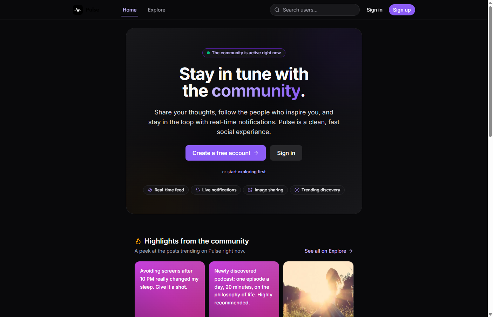
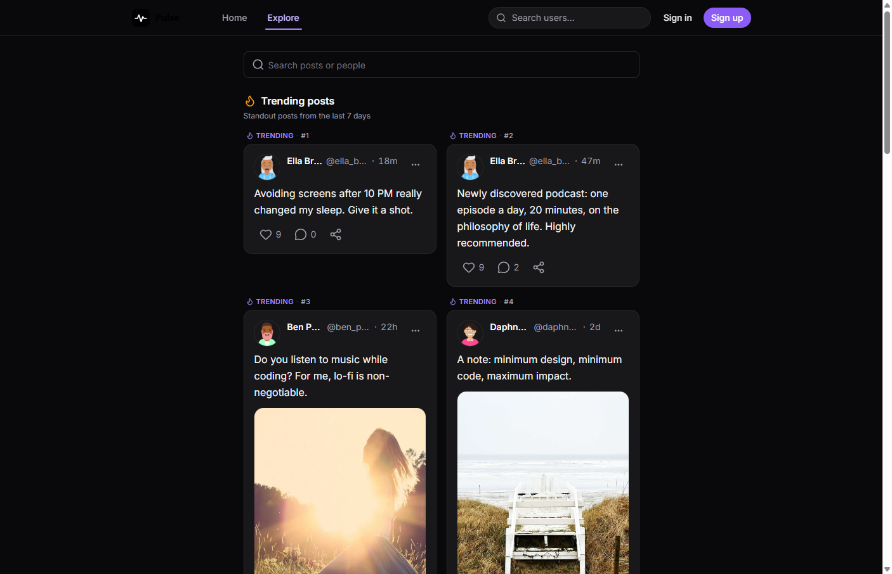
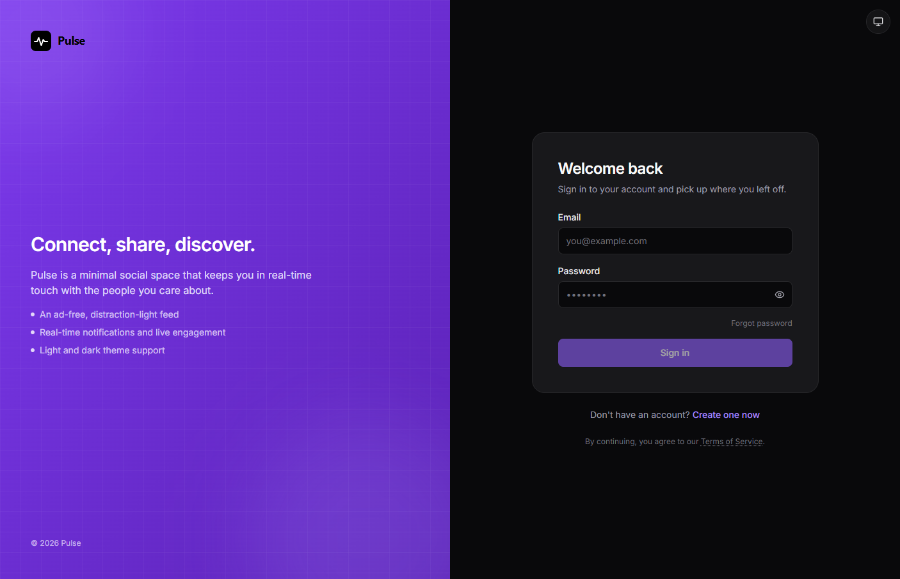
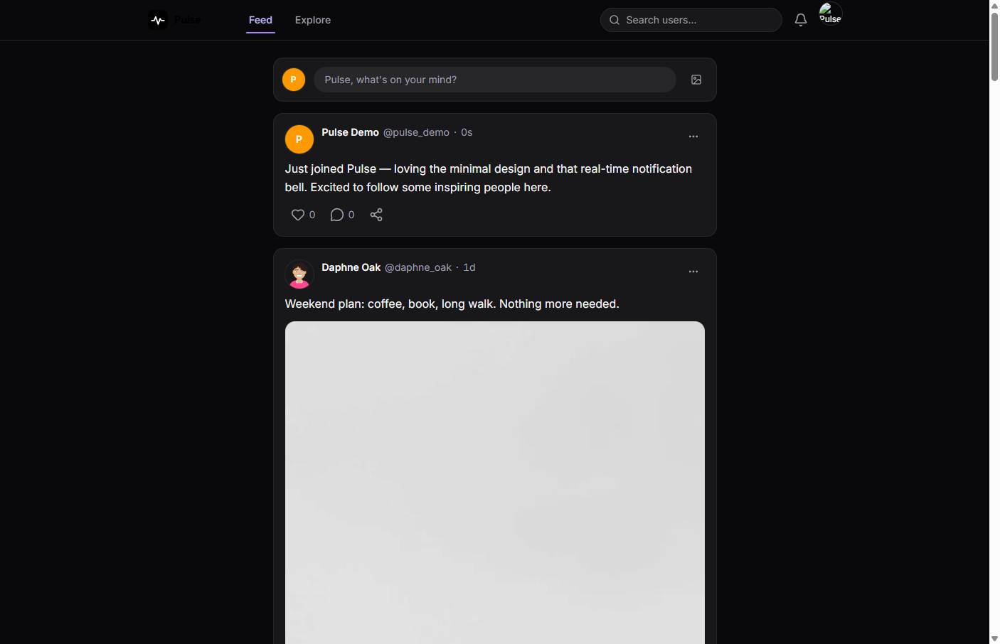
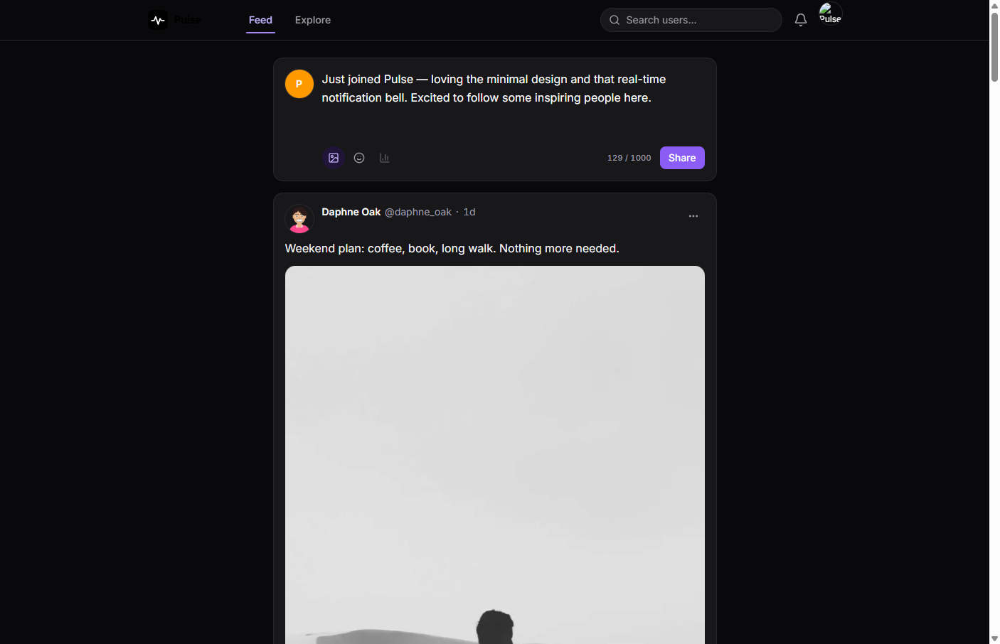
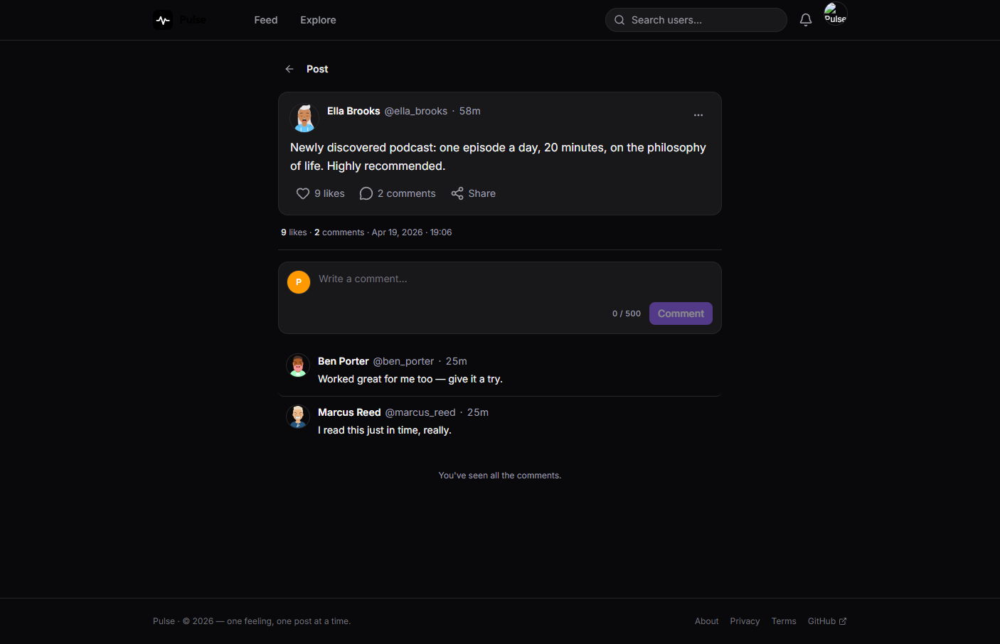
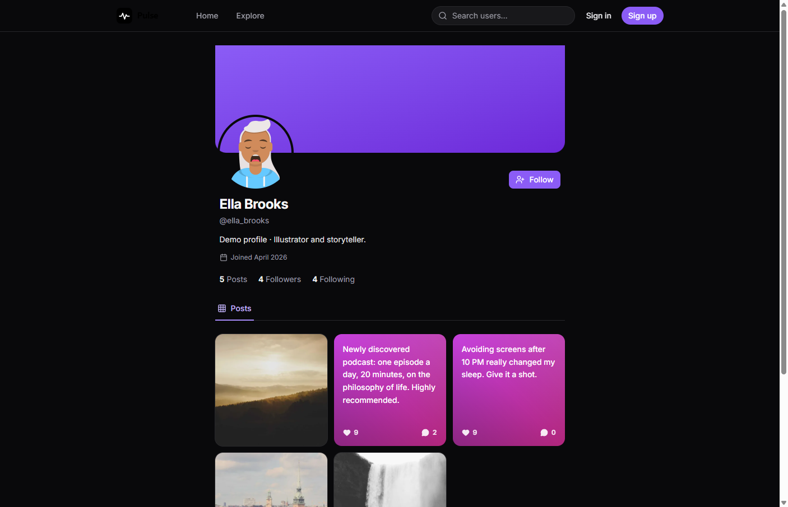
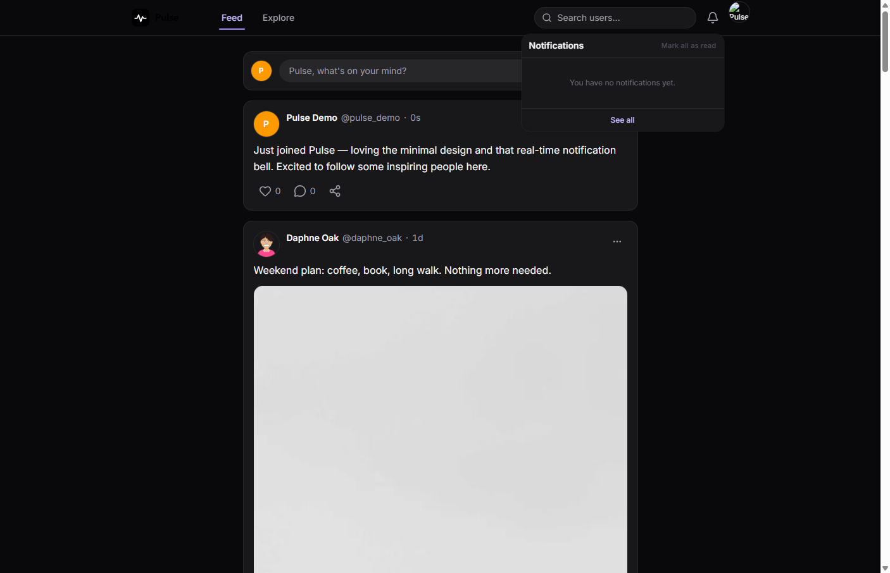
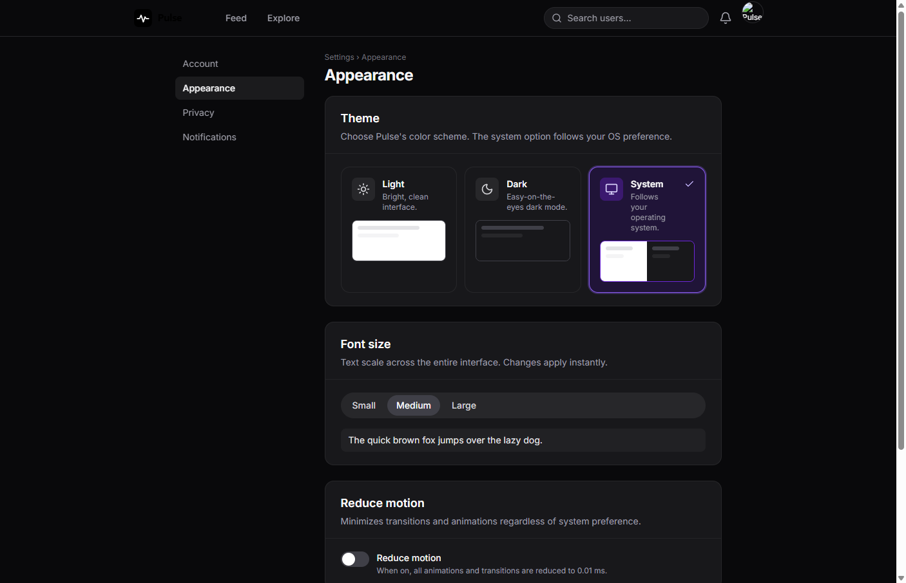
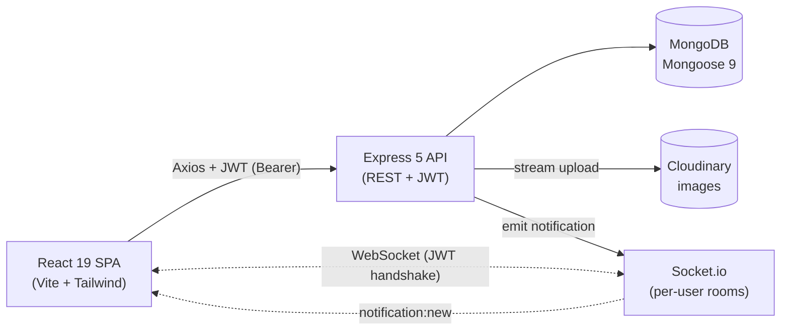

<div align="center">
  <p>
    
    <strong> Pulse</strong>
  </p>

  <h1>Pulse — Social Media Platform</h1>

  <p><em>A full-stack social media platform with JWT authentication, a follow graph, a personalized feed, image posts via Cloudinary, comments, likes, and real-time Socket.io notifications — built on the MERN stack with an accessibility-first React 19 UI.</em></p>

  <p>
    
    
    
    
    
    
    
    
    
    
    
  </p>

  <p>
    <a href="https://social-media-platformm.netlify.app/">Live Demo</a> •
    <a href="#features">Features</a> •
    <a href="#installation">Quick Start</a> •
    <a href="#api-endpoints">API Docs</a> •
    <a href="#screenshots">Screenshots</a>
  </p>

  <a href="https://social-media-platformm.netlify.app/">
    
  </a>
</div>

---

## Features

- **Authentication** — Email and password registration with JWT (7-day default), bcrypt-hashed passwords, change-password flow, and self-service account deletion.
- **User Profiles** — Public profile pages, avatar upload to Cloudinary, bio editor, follower / following lists, and a private-account toggle.
- **Follow Graph** — One-click follow / unfollow with idempotent toggles and conditional updates that prevent counter drift on rapid double-clicks.
- **Posts (CRUD)** — Create posts with text and / or image, edit, and delete. Deletes cascade through comments, notifications, and the Cloudinary asset.
- **Personalized Feed** — Cursor-paginated timeline of authors you follow plus your own posts, with infinite scroll.
- **Explore** — Public trending feed for unauthenticated visitors and discovery.
- **Comments** — Nested under posts; the comment owner, post author, or any admin can delete. Cascade hooks keep counters consistent.
- **Likes** — Idempotent toggle with optimistic UI and race-safe counters.
- **Real-Time Notifications** — Delivered over Socket.io to a private per-user room (`user:{id}`), with unread badge, mark single / mark all, and delete.
- **Settings** — Auto-saving sections for account, appearance (theme + reduced motion), privacy, and notification preferences.
- **Admin Panel** — Dashboard stats, user management (role / active / delete), post moderation (hide / delete), and comment moderation.
- **Accessibility (a11y)** — WCAG 2.1 AA targeted: semantic landmarks, keyboard navigation, `:focus-visible`, ARIA on icon-only buttons, polite live region on the bell, and `prefers-reduced-motion` honoured.
- **Performance** — Route-level `React.lazy()` code splitting, named imports for `lucide-react` and `date-fns`, Cloudinary `f_auto,q_auto`, LCP image hinted with `fetchpriority="high"`, skeletons + `aspect-ratio` to avoid CLS.
- **Security Hardened** — Helmet, CORS whitelist, rate limiting, NoSQL sanitization, JWT, bcrypt, MIME-checked uploads, and authenticated WebSocket handshakes.
- **API Documentation** — Interactive Swagger UI at `/api-docs` and a raw OpenAPI 3 spec at `/api-docs.json`, plus a themed welcome page at `/` with version and quick links.

---

## Live Demo

- 🚀 **Frontend (Netlify):** [social-media-platformm.netlify.app](https://social-media-platformm.netlify.app/)
- ⚙️ **API (Render):** [social-media-platform-u4xr.onrender.com](https://social-media-platform-u4xr.onrender.com/)
- 📖 **API Documentation (Swagger UI):** [`/api-docs`](https://social-media-platform-u4xr.onrender.com/api-docs)

> The frontend is deployed to **Netlify** and the API + Socket.io server is deployed to **Render**. The first request after a cold start may take 30-60 seconds while the free Render instance spins up.

---

## Screenshots

All screenshots are captured from the **[live deployment](https://social-media-platformm.netlify.app/)** running against the seeded demo dataset — a guided tour from the public discovery surfaces down to the authenticated settings.

<table>
  <tr>
    <td align="center" width="33%">
      <a href="./docs/screenshots/01-landing.png"></a>
      <sub><b>Landing</b><br/>Hero, CTAs & trending preview</sub>
    </td>
    <td align="center" width="33%">
      <a href="./docs/screenshots/02-explore.png"></a>
      <sub><b>Explore</b><br/>Trending posts & people to follow</sub>
    </td>
    <td align="center" width="33%">
      <a href="./docs/screenshots/03-login.png"></a>
      <sub><b>Sign In</b><br/>Split-screen, accessible auth form</sub>
    </td>
  </tr>
  <tr>
    <td align="center" width="33%">
      <a href="./docs/screenshots/08-feed.png"></a>
      <sub><b>Personalized Feed</b><br/>Reverse-chronological timeline</sub>
    </td>
    <td align="center" width="33%">
      <a href="./docs/screenshots/09-composer.png"></a>
      <sub><b>Post Composer</b><br/>Text, image, emoji & char counter</sub>
    </td>
    <td align="center" width="33%">
      <a href="./docs/screenshots/18-post-detail-auth.png"></a>
      <sub><b>Post Detail</b><br/>Threaded comments & composer</sub>
    </td>
  </tr>
  <tr>
    <td align="center" width="33%">
      <a href="./docs/screenshots/05-profile.png"></a>
      <sub><b>Public Profile</b><br/>Avatar, bio, counts & post grid</sub>
    </td>
    <td align="center" width="33%">
      <a href="./docs/screenshots/10-notifications-dropdown.png"></a>
      <sub><b>Notifications</b><br/>Real-time bell dropdown over Socket.io</sub>
    </td>
    <td align="center" width="33%">
      <a href="./docs/screenshots/13-settings-appearance.png"></a>
      <sub><b>Settings · Appearance</b><br/>Theme, font size & reduce motion</sub>
    </td>
  </tr>
</table>

> Captured from the live Netlify deployment in dark mode at 1440 × 900. Bonus views — account menu, owner profile, 404 page, and the account / privacy / notifications settings panels — also live in [`docs/screenshots/`](docs/screenshots/).

---

## Architecture

A high-level visual map of the system. Both diagrams render natively on GitHub thanks to Mermaid support.

### Domain Model

How the four core collections relate to each other and how real-time delivery fans out.


### Request Lifecycle

How a single browser action travels through the stack — REST for state changes, WebSocket for live notifications, Cloudinary for media.



---

## Technologies

### Frontend

- **React 19**: Modern UI library with hooks, context, and concurrent rendering
- **Vite 8**: Lightning-fast build tool and dev server
- **Tailwind CSS 4**: Utility-first CSS framework via the official Vite plugin
- **React Router DOM 7**: Declarative routing with lazy loading and Suspense
- **Axios**: Promise-based HTTP client with interceptors for JWT injection
- **Socket.io Client 4**: Real-time WebSocket transport with JWT handshake
- **Lucide React**: Tree-shakeable icon library (named imports only)
- **date-fns**: Modular date utility library for relative timestamps
- **react-hot-toast**: Lightweight, accessible toast notifications
- **@fontsource-variable/inter**: Self-hosted variable Inter font

### Backend

- **Node.js (≥ 20)**: Server-side JavaScript runtime with native ES modules
- **Express 5**: Minimal and flexible web application framework
- **MongoDB (Mongoose 9)**: NoSQL database with elegant ODM and cascade hooks
- **JSON Web Tokens (jsonwebtoken)**: Stateless authentication with token-based sessions
- **bcryptjs**: Password hashing with 12 rounds
- **Socket.io 4**: Real-time bidirectional event-based communication
- **Cloudinary 2**: Cloud-based media management with streamed uploads
- **Multer + Streamifier**: Multipart upload handling with memory storage
- **Helmet**: Sets secure HTTP headers
- **CORS**: Single-origin whitelist with credential support
- **express-rate-limit**: Per-route rate limiting (draft-8 headers)
- **express-validator**: Declarative input validation chains
- **Morgan**: HTTP request logger (development only)

---

## Installation

### Prerequisites

- **Node.js** v20+ and **npm** v10+
- **MongoDB** — MongoDB Atlas (free tier) or a local instance
- **Cloudinary** account — `cloud_name`, `api_key`, `api_secret` (free tier is fine)

### Local Development

**1. Clone the repository:**

```bash
git clone https://github.com/Serkanbyx/social-media-platform.git
cd social-media-platform
```

**2. Set up environment variables:**

```bash
cp server/.env.example server/.env
cp client/.env.example client/.env
```

**server/.env**

```env
NODE_ENV=development
PORT=5000
MONGO_URI=mongodb+srv://<user>:<password>@<cluster>.mongodb.net/social_platform
JWT_SECRET=<min 32 chars — generate it, never reuse>
JWT_EXPIRES_IN=7d
CLIENT_URL=http://localhost:5173
CLOUDINARY_CLOUD_NAME=your_cloud_name
CLOUDINARY_API_KEY=your_api_key
CLOUDINARY_API_SECRET=your_api_secret
ADMIN_EMAIL=your_admin_email@example.com
ADMIN_USERNAME=your_admin_handle
ADMIN_PASSWORD=strong_unique_password_min_8_chars
```

> Generate a strong `JWT_SECRET` with `openssl rand -hex 32` or `node -e "console.log(require('crypto').randomBytes(48).toString('hex'))"`.

**client/.env**

```env
VITE_API_URL=http://localhost:5000/api
VITE_SOCKET_URL=http://localhost:5000
```

**3. Install dependencies:**

```bash
cd server && npm install
cd ../client && npm install
```

**4. Run the application:**

```bash
# Terminal 1 — Backend
cd server && npm run dev

# Terminal 2 — Frontend
cd client && npm run dev
```

The API listens on `http://localhost:5000` and the SPA on `http://localhost:5173`. Visit `http://localhost:5000/api/health` to confirm the server is up, or open `http://localhost:5000/api-docs` to browse the **interactive Swagger / OpenAPI documentation** for every endpoint (also available as raw JSON at `/api-docs.json`).

**5. Seed the admin account (run once):**

```bash
cd server && npm run seed:admin
```

The script reads `ADMIN_EMAIL`, `ADMIN_USERNAME`, and `ADMIN_PASSWORD` from `server/.env` and is **idempotent** — running it again either re-promotes the existing user to `admin` or resets the password.

---

## Usage

1. **Register** a new account from the `/register` page (email + username + password).
2. **Log in** with your credentials. A JWT is issued and stored client-side; Axios attaches it to every request.
3. **Explore** the public trending feed, or browse a public profile to find users to follow.
4. **Follow** other users — their posts will start appearing in your personalized feed at `/`.
5. **Create a post** with text, an image, or both via the composer at the top of the feed.
6. **Like** and **comment** on posts. Each interaction sends a real-time notification to the post / comment author.
7. **Open the bell** in the navbar to see incoming notifications stream in live over Socket.io.
8. **Edit your profile** (avatar, bio, username) and toggle privacy in **Settings → Account / Privacy**.
9. **Switch theme** (light / dark / system) and toggle reduced motion in **Settings → Appearance**.
10. **(Admin only)** Visit `/admin` for the moderation dashboard, user management, and content controls.
11. **Log out** from the user menu, or delete your account from **Settings → Account** (cascades through your posts, comments, likes, and notifications).

---

## How It Works?

### Authentication Flow

1. The client posts credentials to `/api/auth/login` and receives a JWT signed with `JWT_SECRET`.
2. An Axios request interceptor attaches `Authorization: Bearer <token>` to every subsequent API call.
3. The `protect` middleware verifies the token and attaches `req.user`. Public endpoints use `optionalAuth` for richer responses when a token is sent.
4. The `adminOnly` middleware returns `401` for anonymous users and `403` for non-admins, so the client can disambiguate.

```javascript
// client/src/api/axios.js — JWT injection
api.interceptors.request.use((config) => {
  const token = localStorage.getItem("token");
  if (token) config.headers.Authorization = `Bearer ${token}`;
  return config;
});
```

### Real-Time Notification Flow

1. On login, the client opens a Socket.io connection and passes the JWT in the handshake (`auth.token`).
2. The server verifies the token and joins the socket to a private room named `user:{userId}`.
3. When a user likes / comments / follows, the controller creates a `Notification` document and emits `notification:new` to the recipient's room.
4. The client subscribes to `notification:new`, prepends the payload to the dropdown, and increments the unread badge in real time.

```javascript
// server/socket/index.js — JWT-gated handshake
io.use((socket, next) => {
  const token = socket.handshake.auth?.token;
  try {
    const { id } = jwt.verify(token, process.env.JWT_SECRET);
    socket.join(`user:${id}`);
    next();
  } catch {
    next(new Error("unauthorized"));
  }
});
```

### Cascade Architecture

Mongoose document-level `pre('deleteOne')` hooks ensure that deleting a `User` removes their posts, comments, notifications, and Cloudinary avatar in a single transactional flow. The same applies when a post is deleted (its comments, likes, and notifications go with it). Counters are updated with conditional `findOneAndUpdate` operations to stay race-safe under concurrent likes / unlikes.

### Privacy & Anti-Enumeration

Private accounts hide their posts, follower / following lists, and post details from non-followers. Restricted resources return `404` rather than `403` so attackers cannot probe for valid IDs.

---

## API Endpoints

Base URL: `${VITE_API_URL}` (defaults to `http://localhost:5000/api`).

> 📖 **Interactive docs:** every endpoint below is also documented via Swagger UI at [`/api-docs`](http://localhost:5000/api-docs) with request / response schemas and a built-in "Try it out" runner. The raw OpenAPI 3 spec lives at [`/api-docs.json`](http://localhost:5000/api-docs.json).

> Auth column legend: **Public** = no token required • **Optional** = `optionalAuth` (richer response if a valid token is sent) • **User** = `protect` required • **Admin** = `protect` + `adminOnly` required.

### Auth — `/api/auth`

| Method   | Endpoint           | Auth   | Description                                     |
| -------- | ------------------ | ------ | ----------------------------------------------- |
| `POST`   | `/register`        | Public | Create account (rate-limited: 10 / 15min)       |
| `POST`   | `/login`           | Public | Issue JWT (rate-limited: 10 / 15min)            |
| `GET`    | `/me`              | User   | Current user profile + preferences              |
| `PATCH`  | `/change-password` | User   | Verify old password, set new one                |
| `DELETE` | `/delete-account`  | User   | Verify password, hard-delete account + cascade  |

### Users — `/api/users`

| Method  | Endpoint                  | Auth     | Description                                    |
| ------- | ------------------------- | -------- | ---------------------------------------------- |
| `GET`   | `/search?q=...`           | Optional | Autocomplete search (excludes self)            |
| `PATCH` | `/me`                     | User     | Update name / bio / username / preferences     |
| `GET`   | `/:username`              | Optional | Public profile (privacy-aware, `isFollowing`)  |
| `GET`   | `/:username/followers`    | Optional | Cursor-paginated mini-profiles                 |
| `GET`   | `/:username/following`    | Optional | Cursor-paginated mini-profiles                 |
| `POST`  | `/:id/follow`             | User     | Toggle follow / unfollow (idempotent)          |

### Posts & Nested Comments — `/api/posts`

| Method   | Endpoint                | Auth     | Description                                                           |
| -------- | ----------------------- | -------- | --------------------------------------------------------------------- |
| `GET`    | `/explore`              | Optional | Public trending feed (cursor-paginated)                               |
| `GET`    | `/user/:username`       | Optional | A user's posts, privacy-aware                                         |
| `GET`    | `/:id`                  | Optional | Single post detail (404 hides hidden / private / deleted)             |
| `POST`   | `/`                     | User     | Create post (multipart: `content` and / or `image`, ≤ 5 MB)           |
| `PATCH`  | `/:id`                  | User     | Owner-only edit                                                       |
| `DELETE` | `/:id`                  | User     | Owner-or-admin delete (cascade: comments, notifications, Cloudinary)  |
| `POST`   | `/:id/like`             | User     | Toggle like (race-safe counter)                                       |
| `POST`   | `/:postId/comments`     | User     | Create comment                                                        |
| `GET`    | `/:postId/comments`     | Optional | Cursor-paginated comments                                             |

### Comments — `/api/comments`

| Method   | Endpoint | Auth | Description                                                       |
| -------- | -------- | ---- | ----------------------------------------------------------------- |
| `DELETE` | `/:id`   | User | Owner / post-author / admin delete (cascade decrements counter)   |

### Feed — `/api/feed`

| Method | Endpoint | Auth | Description                                                        |
| ------ | -------- | ---- | ------------------------------------------------------------------ |
| `GET`  | `/`      | User | Personalized timeline (followed authors + self), cursor-paginated  |

### Notifications — `/api/notifications`

| Method   | Endpoint        | Auth | Description                                          |
| -------- | --------------- | ---- | ---------------------------------------------------- |
| `GET`    | `/`             | User | Cursor-paginated list scoped to viewer               |
| `GET`    | `/unread-count` | User | Lightweight badge query                              |
| `PATCH`  | `/read-all`     | User | Mark every notification as read                      |
| `PATCH`  | `/:id/read`     | User | Mark a single notification as read (recipient-only)  |
| `DELETE` | `/:id`          | User | Recipient-only delete                                |

### Uploads — `/api/uploads`

| Method   | Endpoint  | Auth | Description                                                  |
| -------- | --------- | ---- | ------------------------------------------------------------ |
| `POST`   | `/avatar` | User | Multipart avatar upload, MIME-checked, ≤ 2 MB, → Cloudinary  |
| `DELETE` | `/avatar` | User | Owner-only avatar removal                                    |

### Admin — `/api/admin`

| Method   | Endpoint            | Auth  | Description                                              |
| -------- | ------------------- | ----- | -------------------------------------------------------- |
| `GET`    | `/stats`            | Admin | Dashboard payload (counts + top users)                   |
| `GET`    | `/users`            | Admin | Paginated list with filters                              |
| `PATCH`  | `/users/:id/role`   | Admin | Promote / demote (self + last-admin protected)           |
| `PATCH`  | `/users/:id/active` | Admin | Enable / disable account (same protections)              |
| `DELETE` | `/users/:id`        | Admin | Hard-delete with cascade (same protections)              |
| `GET`    | `/posts`            | Admin | Paginated list including hidden posts                    |
| `PATCH`  | `/posts/:id/hide`   | Admin | Toggle `isHidden` flag                                   |
| `DELETE` | `/posts/:id`        | Admin | Hard-delete via document `deleteOne` (cascade)           |
| `GET`    | `/comments`         | Admin | Paginated list across all posts                          |
| `DELETE` | `/comments/:id`     | Admin | Hard-delete via document `deleteOne` (cascade)           |

### Health & Real-Time

| Method | Endpoint           | Auth   | Description                                          |
| ------ | ------------------ | ------ | ---------------------------------------------------- |
| `GET`  | `/api/health`      | Public | `{ status, uptime, env, timestamp }` for uptime checks |
| WS     | `notification:new` | User   | Server → client event, populated `Notification` document, scoped to `user:{id}` room |

> All `User`-scoped endpoints require the `Authorization: Bearer <token>` header. The Socket.io handshake requires the same JWT in `auth.token`.

---

## Project Structure

A clean monorepo layout with an explicit backend / frontend split. Each panel below is collapsible — expand the one you care about.

<details open>
<summary><b>Server</b> — Express 5 + Mongoose 9 + Socket.io API</summary>

```
server/
├── config/          # env loader, MongoDB + Cloudinary clients, swagger spec
├── controllers/     # auth, user, post, comment, like, follow, feed, notification, upload, admin
├── middleware/      # protect, optionalAuth, adminOnly, validate, sanitize, rateLimiters, upload, errorHandler
├── models/          # User, Post, Comment, Notification (with cascade hooks)
├── routes/          # one router per feature, mounted under /api/*
├── seed/            # adminSeed (idempotent bootstrap), demoSeed, wipeDemo
├── services/        # cross-controller helpers (notifications, etc.)
├── socket/          # Socket.io bootstrap + JWT handshake + per-user rooms
├── utils/           # asyncHandler, escapeRegex, generateToken, pickFields
├── validators/      # express-validator chains per resource
├── index.js         # Express app + http.Server + Socket.io entry point
├── .env.example     # placeholders only — never commit a real .env
└── package.json
```

</details>

<details>
<summary><b>Client</b> — React 19 + Vite 8 SPA</summary>

```
client/
├── public/          # favicon, _redirects for Netlify SPA routing
├── src/
│   ├── api/         # Axios instance + JWT interceptor
│   ├── assets/      # local logo SVGs
│   ├── components/  # admin, guards, layout, notification, post, settings, ui, user
│   ├── context/     # AuthContext, NotificationContext, PreferencesContext, SocketContext
│   ├── hooks/       # useInfiniteScroll, useDebounce, useMediaQuery, useClickOutside…
│   ├── pages/       # auth, feed, explore, post, profile, notifications, settings, admin
│   ├── services/    # API wrappers per resource
│   ├── utils/       # date, format, linkify, validation helpers
│   ├── App.jsx      # route tree (lazy + Suspense + ErrorBoundary)
│   ├── main.jsx     # React root + providers
│   └── index.css    # Tailwind layers + design tokens
├── .env.example
├── eslint.config.js
├── vite.config.js
└── package.json
```

</details>

<details>
<summary><b>Repository root</b> — docs, governance & deployment config</summary>

```
social-media-platform/
├── client/          # → see Client panel above
├── server/          # → see Server panel above
├── docs/            # build-guide.md (original roadmap) + screenshots/
├── .github/         # issue templates, PR template, CODE_OF_CONDUCT, CONTRIBUTING, SECURITY
├── .gitignore       # excludes every .env, node_modules, dist, uploads, logs
├── netlify.toml     # Netlify build + SPA redirects
├── render.yaml      # Render service blueprint
├── LICENSE          # MIT
└── README.md        # this file
```

</details>

---

## Security

- **Secure Headers** — `helmet()` and `app.disable('x-powered-by')` are set in `server/index.js`.
- **CORS Whitelist** — Single origin from `env.CLIENT_URL`, credentials enabled, only `GET / POST / PATCH / DELETE` whitelisted; the same origin is reused for the Socket.io handshake.
- **Body Size Limits** — `express.json({ limit: "10kb" })` and matching urlencoded limit guard against DoS via huge bodies.
- **NoSQL Injection** — Custom `sanitize` middleware strips `$`-prefixed keys from `req.body` and `req.params` (Express 5-safe; `req.query` is read-only in Express 5 so it is not mutated).
- **Rate Limiting** — `globalLimiter` 300 / 15min on every `/api/*` route, `authLimiter` 10 / 15min on `/auth/login` + `/auth/register`, `writeLimiter` 30 / min on every mutation, `adminLimiter` 100 / 15min on the entire admin router.
- **Authentication** — JWT (≥ 32-char secret enforced in production), bcrypt (12 rounds), `protect` middleware verifies and attaches `req.user`, `optionalAuth` enriches public endpoints, `adminOnly` returns 401 for anonymous and 403 for non-admins.
- **Authorization** — Owner-or-admin checks in every mutation controller; admin endpoints additionally guard against self-demotion, self-deletion, and last-admin removal.
- **Privacy Enforcement** — Private accounts hide their posts and follower / following lists from non-followers, server-enforced.
- **Anti-Enumeration** — Missing, hidden, or privately-restricted resources return `404`, not `403`, so attackers cannot probe for IDs.
- **Upload Hardening** — `multer` memoryStorage, MIME whitelist (`image/png · image/jpeg · image/webp · image/gif`), per-route file size caps (avatar 2 MB, post image 5 MB), streamed to Cloudinary.
- **Real-Time Security** — Socket.io handshake requires a valid JWT; clients are joined to a private `user:{id}` room, so other users cannot subscribe to your notifications.
- **Output Sanitization** — User-authored content is rendered with React's default escaping; no `dangerouslySetInnerHTML` anywhere in the client.
- **Error Handling** — Global handler returns `{ status, message }` and only includes the stack trace when `NODE_ENV !== 'production'`.
- **Secret Management** — `.env` is gitignored; only `.env.example` files (placeholders) are tracked. JWT and admin password requirements are validated at boot / seed time.

> See [SECURITY.md](.github/SECURITY.md) for the responsible disclosure policy.

---

## Deployment

End-to-end deployment uses **MongoDB Atlas + Cloudinary + Render (API + Socket.io) + Netlify (SPA)**.

### Backend (Render)

1. Push your repository to GitHub.
2. Create a new **Web Service** on [Render](https://render.com/) and connect the repo.
3. Set **Root Directory** to `server`, **Build Command** to `npm install`, and **Start Command** to `npm start`.
4. Add the environment variables below.
5. Deploy and run `node seed/adminSeed.js` once via the Render Shell.

| Variable                | Value                                                          |
| ----------------------- | -------------------------------------------------------------- |
| `NODE_ENV`              | `production`                                                   |
| `PORT`                  | `5000` (Render assigns automatically; honour `process.env.PORT`) |
| `MONGO_URI`             | Your MongoDB Atlas connection string                           |
| `JWT_SECRET`            | A **fresh** 32+ character secret (do not reuse the dev secret) |
| `JWT_EXPIRES_IN`        | `7d`                                                           |
| `CLIENT_URL`            | The deployed Netlify URL (no trailing slash)                   |
| `CLOUDINARY_CLOUD_NAME` | Your Cloudinary cloud name                                     |
| `CLOUDINARY_API_KEY`    | Your Cloudinary API key                                        |
| `CLOUDINARY_API_SECRET` | Your Cloudinary API secret                                     |
| `ADMIN_EMAIL`           | Your admin email                                               |
| `ADMIN_USERNAME`        | Your admin username                                            |
| `ADMIN_PASSWORD`        | Strong unique password (remove after seeding to reduce blast radius) |

### Frontend (Netlify)

1. Create a new site on [Netlify](https://netlify.com/) and connect the same repo.
2. Set **Base Directory** to `client`, **Build Command** to `npm run build`, and **Publish Directory** to `client/dist`.
3. Add the environment variables below.
4. Ensure `client/public/_redirects` contains `/* /index.html 200` so React Router deep links work.

| Variable          | Value                                              |
| ----------------- | -------------------------------------------------- |
| `VITE_API_URL`    | `https://<your-render-service>.onrender.com/api`   |
| `VITE_SOCKET_URL` | `https://<your-render-service>.onrender.com`       |

> **Critical:** `CLIENT_URL` on the API and `VITE_API_URL` / `VITE_SOCKET_URL` on the SPA must match the deployed URLs **exactly** (no trailing slash) — otherwise CORS or the WebSocket handshake will reject every request.

---

## Features in Detail

### Completed Features

- ✅ JWT authentication with bcrypt-hashed passwords
- ✅ Full posts / comments / likes / follows CRUD with cascade deletes
- ✅ Personalized cursor-paginated feed + public explore feed
- ✅ Real-time notifications over Socket.io with private per-user rooms
- ✅ Cloudinary avatar + post-image uploads with MIME validation
- ✅ Admin moderation panel (users, posts, comments)
- ✅ Auto-saving settings (account, appearance, privacy, notifications)
- ✅ Light / dark / system theme + reduced-motion override
- ✅ WCAG 2.1 AA accessibility baseline
- ✅ Security hardening (Helmet, CORS, rate limits, NoSQL sanitization)
- ✅ Public deployment to Netlify + Render

### Future Features

- [ ] Direct messaging (DMs) over Socket.io
- [ ] Hashtag indexing and trending tags
- [ ] Bookmarks and saved posts
- [ ] Email verification + password reset flow
- [ ] Two-factor authentication (TOTP)
- [ ] Multi-image post galleries with carousel
- [ ] Push notifications via the Web Push API

---

## Contributing

Contributions are welcome! Please follow these steps:

1. Fork the repository
2. Create a feature branch (`git checkout -b feat/amazing-feature`)
3. Commit your changes (`git commit -m "feat: add amazing feature"`)
4. Push to the branch (`git push origin feat/amazing-feature`)
5. Open a Pull Request

### Commit Message Format

| Prefix      | Description                        |
| ----------- | ---------------------------------- |
| `feat:`     | New feature                        |
| `fix:`      | Bug fix                            |
| `refactor:` | Code refactoring                   |
| `docs:`     | Documentation changes              |
| `style:`    | Formatting, no code change         |
| `chore:`    | Maintenance and dependency updates |

---

## License

This project is released under the **MIT License**. See the [LICENSE](LICENSE) file for the full text.

---

## Developer

**Serkan Bayraktar**

- 🌐 Website: [serkanbayraktar.com](https://serkanbayraktar.com/)
- 💻 GitHub: [@Serkanbyx](https://github.com/Serkanbyx)
- 📧 Email: [serkanbyx1@gmail.com](mailto:serkanbyx1@gmail.com)

---

## Acknowledgments

- [React Documentation](https://react.dev/) — modern hooks-first React patterns
- [Vite Guide](https://vitejs.dev/) — blazing-fast dev server and build tooling
- [Tailwind CSS Docs](https://tailwindcss.com/docs) — utility-first styling
- [Express 5 Documentation](https://expressjs.com/) — minimal Node.js framework
- [Mongoose Documentation](https://mongoosejs.com/) — elegant MongoDB ODM
- [Socket.io Documentation](https://socket.io/docs/v4/) — real-time WebSocket transport
- [Cloudinary Documentation](https://cloudinary.com/documentation) — media management
- [OWASP Cheat Sheet Series](https://cheatsheetseries.owasp.org/) — security best practices
- [WCAG 2.1 Guidelines](https://www.w3.org/TR/WCAG21/) — accessibility standards
- [Lucide Icons](https://lucide.dev/) — beautiful, tree-shakeable icon library

---

## Contact

- 🐛 Found a bug? [Open an issue](https://github.com/Serkanbyx/social-media-platform/issues)
- 📧 Email: [serkanbyx1@gmail.com](mailto:serkanbyx1@gmail.com)
- 🌐 Website: [serkanbayraktar.com](https://serkanbayraktar.com/)

---

⭐ If you like this project, don't forget to give it a star!
