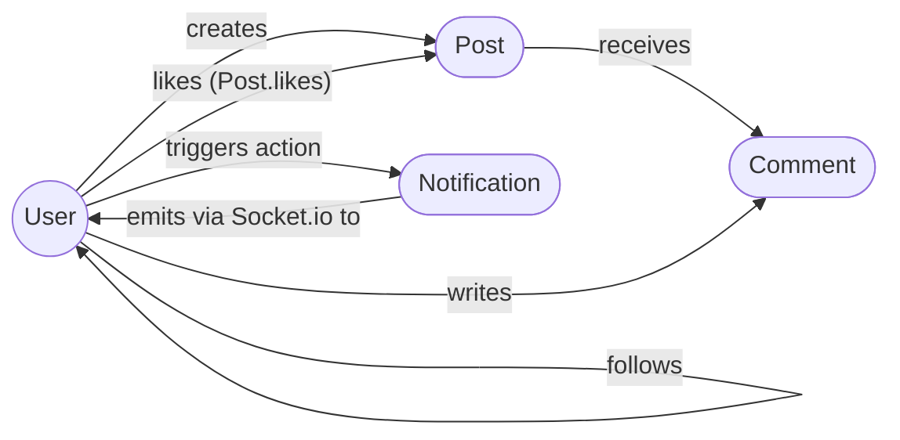
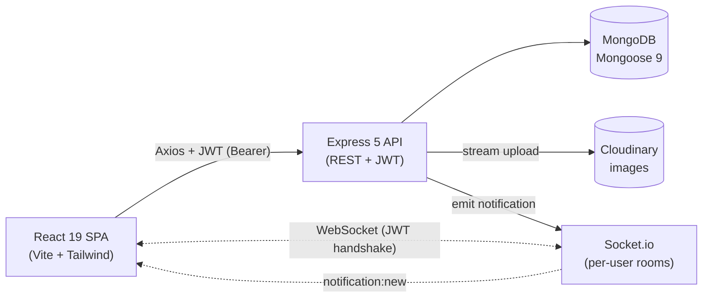

# Pulse — Social Media Platform

> A full-stack social platform with follow graphs, personalized feed, image posts, comments, likes, and **real-time** notifications.


---

## Screenshots

> Add real screenshots here once the project is deployed. Suggested order: Login → Feed → Post Detail → Profile → Notifications → Admin Dashboard. **Never paste a screenshot that shows a token in DevTools, a populated `localStorage`, or any real credential.**

```
docs/screenshots/
├── 01-login.png
├── 02-feed.png
├── 03-post-detail.png
├── 04-profile.png
├── 05-notifications.png
└── 06-admin.png
```

---

## Architecture

### Domain model



### Request lifecycle



---

## Features

- **Authentication** — Email + password, JWT (7-day default), bcrypt-hashed passwords, change-password, delete-account.
- **Profiles** — Public profile pages, avatar upload (Cloudinary), bio, follower / following lists, private-account toggle.
- **Follow graph** — One-click follow/unfollow, idempotent toggle, conditional updates (no counter drift on double-click).
- **Posts** — Create with text and/or image, edit, delete (cascade deletes comments + notifications + Cloudinary asset), per-post privacy aware of author privacy.
- **Feed** — Personalized timeline of authors you follow + your own posts, cursor-paginated, infinite scroll.
- **Explore** — Public trending feed for unauthenticated visitors.
- **Comments** — Nested under posts, owner / post-author / admin can delete, cascade hooks keep counters consistent.
- **Likes** — Idempotent toggle with optimistic UI, race-safe counters.
- **Notifications** — Real-time delivery over Socket.io to a private per-user room (`user:{id}`), unread badge, mark single / mark all, delete.
- **Settings** — Auto-saving account, appearance (theme + reduced motion), privacy, notification preferences.
- **Admin panel** — Dashboard stats, user management (role / active / delete), post moderation (hide / delete), comment moderation.
- **A11y baseline** — WCAG 2.1 AA targeted: semantic landmarks, keyboard navigation, `:focus-visible`, ARIA on icon-only buttons, polite live region on the bell, reduced-motion respected.
- **Performance** — Route-level `React.lazy()` code splitting, named imports for `lucide-react` / `date-fns`, Cloudinary `f_auto,q_auto`, LCP image hinted with `fetchpriority="high"`, skeletons + `aspect-ratio` to avoid CLS.

---

## Roles & Permissions

| Capability                                    | Guest | User | Admin |
| --------------------------------------------- | :---: | :--: | :---: |
| Browse `/explore` and any public post detail  |   ✓   |  ✓   |   ✓   |
| Browse a public profile                       |   ✓   |  ✓   |   ✓   |
| Browse a private profile / private post       |   —   |  ✓ (only as a follower) | ✓ |
| Register / log in                             |   ✓   |  —   |   —   |
| View `/` personalized feed                    |   —   |  ✓   |   ✓   |
| Create / edit / delete **own** post           |   —   |  ✓   |   ✓   |
| Comment on a post                             |   —   |  ✓   |   ✓   |
| Delete **own** comment                        |   —   |  ✓   |   ✓   |
| Delete a comment on **own** post              |   —   |  ✓   |   ✓   |
| Like / unlike a post                          |   —   |  ✓   |   ✓   |
| Follow / unfollow another user                |   —   |  ✓   |   ✓   |
| Edit own profile, upload / remove own avatar  |   —   |  ✓   |   ✓   |
| Receive real-time notifications               |   —   |  ✓   |   ✓   |
| Change password / delete own account          |   —   |  ✓   |   ✓   |
| Access `/admin/*` panel                       |   —   |  —   |   ✓   |
| Hide / delete **any** post                    |   —   |  —   |   ✓   |
| Delete **any** comment                        |   —   |  —   |   ✓   |
| Promote / demote user role, toggle active     |   —   |  —   |   ✓   |
| Hard-delete a user (with cascade)             |   —   |  —   |   ✓   |

> **Last-admin & self protections.** An admin cannot demote themselves, deactivate themselves, delete themselves, or remove the last remaining admin. These are enforced server-side in `controllers/adminController.js`.

---

## API Endpoints

Base URL: `${VITE_API_URL}` (defaults to `http://localhost:5000/api`).

Auth column legend: **Public** = no token required, **Optional** = `optionalAuth` (richer response if a valid token is sent), **User** = `protect` required, **Admin** = `protect` + `adminOnly` required.

### Auth — `/api/auth`

| Method   | Endpoint           | Auth | Description                                     |
| -------- | ------------------ | ---- | ----------------------------------------------- |
| `POST`   | `/register`        | Public | Create account (rate-limited: 10 / 15min).    |
| `POST`   | `/login`           | Public | Issue JWT (rate-limited: 10 / 15min).         |
| `GET`    | `/me`              | User | Current user profile + preferences.             |
| `PATCH`  | `/change-password` | User | Verify old password, set new one.               |
| `DELETE` | `/delete-account`  | User | Verify password, hard-delete account + cascade. |

### Users — `/api/users`

| Method  | Endpoint                  | Auth     | Description                                    |
| ------- | ------------------------- | -------- | ---------------------------------------------- |
| `GET`   | `/search?q=...`           | Optional | Autocomplete search (excludes self).           |
| `PATCH` | `/me`                     | User     | Update name / bio / username / preferences.    |
| `GET`   | `/:username`              | Optional | Public profile (privacy-aware, `isFollowing`). |
| `GET`   | `/:username/followers`    | Optional | Cursor-paginated mini-profiles.                |
| `GET`   | `/:username/following`    | Optional | Cursor-paginated mini-profiles.                |
| `POST`  | `/:id/follow`             | User     | Toggle follow / unfollow (idempotent).         |

### Posts & nested comments — `/api/posts`

| Method   | Endpoint                       | Auth     | Description                                                                |
| -------- | ------------------------------ | -------- | -------------------------------------------------------------------------- |
| `GET`    | `/explore`                     | Optional | Public trending feed (cursor-paginated).                                   |
| `GET`    | `/user/:username`              | Optional | A user's posts, privacy-aware.                                             |
| `GET`    | `/:id`                         | Optional | Single post detail (404 hides hidden / private / deleted).                 |
| `POST`   | `/`                            | User     | Create post (multipart: `content` and/or `image`, ≤5 MB).                  |
| `PATCH`  | `/:id`                         | User     | Owner-only edit.                                                           |
| `DELETE` | `/:id`                         | User     | Owner-or-admin delete (cascade: comments, notifications, Cloudinary).      |
| `POST`   | `/:id/like`                    | User     | Toggle like (race-safe counter).                                           |
| `POST`   | `/:postId/comments`            | User     | Create comment.                                                            |
| `GET`    | `/:postId/comments`            | Optional | Cursor-paginated comments.                                                 |

### Comments — `/api/comments`

| Method   | Endpoint | Auth | Description                                                       |
| -------- | -------- | ---- | ----------------------------------------------------------------- |
| `DELETE` | `/:id`   | User | Owner / post-author / admin delete (cascade decrements counter).  |

### Feed — `/api/feed`

| Method | Endpoint | Auth | Description                                                       |
| ------ | -------- | ---- | ----------------------------------------------------------------- |
| `GET`  | `/`      | User | Personalized timeline (followed authors + self), cursor-paginated. |

### Notifications — `/api/notifications`

| Method   | Endpoint           | Auth | Description                                       |
| -------- | ------------------ | ---- | ------------------------------------------------- |
| `GET`    | `/`                | User | Cursor-paginated list scoped to viewer.           |
| `GET`    | `/unread-count`    | User | Lightweight badge query.                          |
| `PATCH`  | `/read-all`        | User | Mark every notification as read.                  |
| `PATCH`  | `/:id/read`        | User | Mark a single notification as read (recipient-only). |
| `DELETE` | `/:id`             | User | Recipient-only delete.                            |

### Uploads — `/api/uploads`

| Method   | Endpoint   | Auth | Description                                              |
| -------- | ---------- | ---- | -------------------------------------------------------- |
| `POST`   | `/avatar`  | User | Multipart avatar upload, MIME-checked, ≤2 MB, → Cloudinary. |
| `DELETE` | `/avatar`  | User | Owner-only avatar removal.                               |

### Admin — `/api/admin`

| Method   | Endpoint              | Auth  | Description                                                          |
| -------- | --------------------- | ----- | -------------------------------------------------------------------- |
| `GET`    | `/stats`              | Admin | Dashboard payload (counts + top users).                              |
| `GET`    | `/users`              | Admin | Paginated list with filters.                                         |
| `PATCH`  | `/users/:id/role`     | Admin | Promote / demote (self + last-admin protected).                      |
| `PATCH`  | `/users/:id/active`   | Admin | Enable / disable account (same protections).                         |
| `DELETE` | `/users/:id`          | Admin | Hard-delete with cascade (same protections).                         |
| `GET`    | `/posts`              | Admin | Paginated list including hidden posts.                               |
| `PATCH`  | `/posts/:id/hide`     | Admin | Toggle `isHidden` flag.                                              |
| `DELETE` | `/posts/:id`          | Admin | Hard-delete via document `deleteOne` (cascade).                      |
| `GET`    | `/comments`           | Admin | Paginated list across all posts.                                     |
| `DELETE` | `/comments/:id`       | Admin | Hard-delete via document `deleteOne` (cascade).                      |

### Health

| Method | Endpoint      | Auth   | Description                                          |
| ------ | ------------- | ------ | ---------------------------------------------------- |
| `GET`  | `/api/health` | Public | `{ status, uptime, env, timestamp }` for uptime checks. |

### Real-time (Socket.io)

| Channel             | Direction        | Payload                            | Description                                 |
| ------------------- | ---------------- | ---------------------------------- | ------------------------------------------- |
| (handshake)         | client → server  | `auth.token` = JWT                 | Required on connect; rejected if invalid.   |
| `notification:new`  | server → client  | populated `Notification` document  | Emitted into the recipient's `user:{id}` room. |

---

## Folder Structure

```
social-platform/
├── server/                         # Node 20+ • Express 5 • Mongoose 9
│   ├── config/                     # env loader, MongoDB + Cloudinary clients
│   ├── controllers/                # auth · user · post · comment · like · follow · feed · notification · upload · admin
│   ├── middleware/                 # auth · optionalAuth · adminOnly · validate · sanitize · rateLimiters · upload · errorHandler
│   ├── models/                     # User · Post · Comment · Notification (with cascade hooks)
│   ├── routes/                     # one router per feature, mounted under /api/*
│   ├── seed/                       # adminSeed.js — idempotent admin bootstrap
│   ├── services/                   # cross-controller helpers (notifications, etc.)
│   ├── socket/                     # Socket.io bootstrap + JWT handshake + per-user rooms
│   ├── utils/                      # cookies, asyncHandler, ApiError…
│   ├── validators/                 # express-validator chains per resource
│   ├── index.js                    # app + http.Server + Socket.io entry point
│   ├── .env.example                # placeholders only — never commit a real .env
│   └── package.json
│
├── client/                         # React 19 • Vite 8 • TailwindCSS 4
│   ├── public/                     # static assets, _redirects for Netlify SPA
│   ├── src/
│   │   ├── api/                    # axios instance + endpoint wrappers
│   │   ├── assets/                 # local images, icons, fonts
│   │   ├── components/
│   │   │   ├── admin/              # admin tables, action menus
│   │   │   ├── guards/             # ProtectedRoute · GuestOnlyRoute · AdminRoute
│   │   │   ├── layout/             # MainLayout · SettingsLayout · AdminLayout · AuthShell · Navbar · Sidebar · Footer
│   │   │   ├── notification/       # bell, dropdown, list item
│   │   │   ├── post/               # PostCard, composer, image grid…
│   │   │   ├── settings/           # form sections (account, appearance, privacy, notifications)
│   │   │   ├── ui/                 # Spinner · Banner · ErrorBoundary · PasswordInput · Modal · Skeleton…
│   │   │   └── user/               # avatars, mini-profiles, follow button
│   │   ├── context/                # AuthContext · ToastContext · ThemeContext · SocketContext
│   │   ├── hooks/                  # useInfiniteScroll, useDebouncedValue, useMediaQuery…
│   │   ├── pages/                  # auth · feed · explore · post · profile · notifications · settings · admin · NotFoundPage
│   │   ├── services/               # socket client, notification service…
│   │   ├── utils/                  # date, format, validation helpers
│   │   ├── App.jsx                 # route tree (lazy + Suspense + ErrorBoundary)
│   │   ├── main.jsx                # React root + providers
│   │   └── index.css               # Tailwind layers + design tokens
│   ├── .env.example
│   ├── eslint.config.js
│   ├── vite.config.js
│   └── package.json
│
├── .gitignore                      # excludes every .env, node_modules, dist, uploads, logs…
├── README.md                       # this file
└── STEPS.md                        # 41-step build guide (used to generate the project)
```

---

## Security

The full audit lives in `STEPS.md` (STEP 19). The shipped baseline:

- **Headers** — `helmet()` and `app.disable('x-powered-by')` set in `server/index.js`.
- **CORS** — Single origin from `env.CLIENT_URL`, credentials enabled, only `GET / POST / PATCH / DELETE` whitelisted; the same origin is reused for the Socket.io handshake.
- **Body limits** — `express.json({ limit: "10kb" })` and matching urlencoded limit guard against DoS via huge bodies.
- **NoSQL injection** — Custom `sanitize` middleware strips `$`-prefixed keys from `req.body` and `req.params` (Express 5-safe; `req.query` is read-only in Express 5 so we don't mutate it).
- **Rate limiting** — `globalLimiter` 300 / 15min on every `/api/*` route, `authLimiter` 10 / 15min on `/auth/login` + `/auth/register`, `writeLimiter` 30 / min on every mutation, `adminLimiter` 100 / 15min on the entire admin router.
- **Auth** — JWT (≥ 32-char secret enforced in production), bcrypt (12 rounds), `protect` middleware verifies + attaches `req.user`, `optionalAuth` enriches public endpoints, `adminOnly` returns 401 for anonymous and 403 for non-admins so the client can disambiguate.
- **Authorization** — Owner-or-admin checks in every mutation controller; admin endpoints additionally guard against self-demotion / self-deletion / last-admin removal.
- **Privacy** — Private accounts hide their posts, follower / following lists from non-followers (server-enforced).
- **Anti-enumeration** — Missing / hidden / privately-restricted resources return `404`, not `403`, so attackers can't probe for ids.
- **Uploads** — `multer` memoryStorage, MIME whitelist (`image/png · image/jpeg · image/webp · image/gif`), per-route file size caps (avatar 2 MB, post image 5 MB), streamed to Cloudinary.
- **Real-time** — Socket.io handshake requires a valid JWT; clients are joined to a private `user:{id}` room, so other users cannot subscribe to your notifications.
- **Output sanitization** — User-authored content is rendered with React's default escaping; no `dangerouslySetInnerHTML` anywhere in the client.
- **Error handler** — Global handler returns `{ status, message }` and only includes the stack trace when `NODE_ENV !== 'production'`.
- **Secrets** — `.env` is gitignored; only `.env.example` files (placeholders) are tracked. JWT and admin password requirements are validated at boot / seed time.

---

## Getting Started

### Prerequisites

- **Node.js ≥ 20** and **npm ≥ 10**
- A **MongoDB** connection string (local Mongo or a free MongoDB Atlas cluster)
- A **Cloudinary** account (free tier is fine) — `cloud_name`, `api_key`, `api_secret`

### 1. Clone

```bash
git clone https://github.com/<your-username>/social-platform.git
cd social-platform
```

### 2. Configure environment files

Copy the templates and fill in **your own** values — never commit the resulting `.env` files (they are already in `.gitignore`).

```bash
cp server/.env.example server/.env
cp client/.env.example client/.env
```

`server/.env` — generate a strong JWT secret, e.g.:

```bash
# any of these works
openssl rand -hex 32
node -e "console.log(require('crypto').randomBytes(48).toString('hex'))"
```

Required keys:

```
NODE_ENV=development
PORT=5000
MONGO_URI=mongodb+srv://<user>:<password>@<cluster>.mongodb.net/social_platform
JWT_SECRET=<min 32 chars — generate it, never reuse>
JWT_EXPIRES_IN=7d
CLIENT_URL=http://localhost:5173
CLOUDINARY_CLOUD_NAME=<your cloud name>
CLOUDINARY_API_KEY=<your api key>
CLOUDINARY_API_SECRET=<your api secret>
ADMIN_EMAIL=<your real email>
ADMIN_USERNAME=<your handle>
ADMIN_PASSWORD=<strong unique password — letter + digit, ≥ 8 chars>
```

`client/.env`:

```
VITE_API_URL=http://localhost:5000/api
VITE_SOCKET_URL=http://localhost:5000
```

### 3. Install and run

```bash
# Terminal A — API
cd server
npm install
npm run dev

# Terminal B — SPA
cd client
npm install
npm run dev
```

The API listens on `http://localhost:5000` and the SPA on `http://localhost:5173`. Visit the SPA and check `http://localhost:5000/api/health` to confirm the server is up.

### 4. Seed the admin account (run once)

```bash
cd server
npm run seed:admin
```

The script reads `ADMIN_EMAIL` / `ADMIN_USERNAME` / `ADMIN_PASSWORD` from `server/.env` and is **idempotent** — running it again either re-promotes the existing user to `admin` or resets the password.

---

## Admin Access

This project **does not ship with a default demo admin account** for security reasons. After running `npm run seed:admin` with **your own** `.env` values, log in with the credentials you defined locally.

> **Do NOT publish your admin credentials in the README, in screenshots, in commit messages, or anywhere in the repository.** If you ever paste a token into an issue or screenshot by accident, rotate it immediately at the provider and re-issue the seed.

---

## Available Scripts

### `server/`

| Script               | What it does                                                          |
| -------------------- | --------------------------------------------------------------------- |
| `npm run dev`        | Start the API with `nodemon` (hot reload).                            |
| `npm start`          | Start the API in production mode.                                     |
| `npm run seed:admin` | Bootstrap / promote the admin account from `.env`. **Idempotent.**    |

### `client/`

| Script            | What it does                                                |
| ----------------- | ----------------------------------------------------------- |
| `npm run dev`     | Start Vite dev server on `5173`.                            |
| `npm run build`   | Production build into `client/dist/`.                       |
| `npm run preview` | Locally preview the production build.                       |
| `npm run lint`    | ESLint over the entire client.                              |

---

## Tech Stack

**Client**

- React 19 + Vite 8
- TailwindCSS 4 (`@tailwindcss/vite`)
- React Router DOM 7
- Axios for REST, `socket.io-client` for real-time
- `lucide-react` icons, `date-fns` for relative time, `react-hot-toast` for toasts
- Self-hosted variable Inter via `@fontsource-variable/inter`

**Server**

- Node ≥ 20, ES modules, Express 5
- Mongoose 9 (Atlas-friendly)
- JSON Web Tokens (`jsonwebtoken`), bcrypt (`bcryptjs`)
- Socket.io 4 (same HTTP server)
- Cloudinary 2 (streamed uploads via `multer` memoryStorage + `streamifier`)
- Helmet, CORS, `express-rate-limit` (draft-8 headers), custom NoSQL sanitizer, `express-validator`, Morgan (dev only)

---

## Accessibility & Performance

A summary of the built-in baselines (full notes lived in this README until STEP 39 expanded it):

- **A11y** — WCAG 2.1 AA targeted: semantic landmarks, skip-to-content link, `:focus-visible` outlines, ARIA on icon-only buttons / toggles / live regions, labelled forms with `aria-invalid` + `aria-describedby`, `prefers-reduced-motion` honoured (with manual override in **Settings → Appearance**).
- **Performance** — Route-level `React.lazy()` code splitting, named imports for `lucide-react` / `date-fns`, Cloudinary `f_auto,q_auto`, LCP image hinted with `fetchpriority="high"`, low-quality blur placeholders, skeletons + `aspect-ratio` to avoid CLS, optimistic mutations for INP, font-display: swap on Inter.
- **Targets** — Lighthouse Performance ≥ 90 (mobile), Accessibility ≥ 95, Best Practices ≥ 95, SEO ≥ 90.

If you spot an a11y regression, please open an issue with steps to reproduce.

---

## Deployment

End-to-end deployment to **MongoDB Atlas + Cloudinary + Render (API + Socket.io) + Netlify (SPA)** is documented in detail in `STEPS.md` → **STEP 41**.

Highlights:

- The API is deployed to **Render** as a single Web Service that hosts both the REST API and the Socket.io server (same port).
- The SPA is deployed to **Netlify**; remember to add `client/public/_redirects` containing `/* /index.html 200` so React Router deep links work.
- `CLIENT_URL` on the API and `VITE_API_URL` / `VITE_SOCKET_URL` on the SPA must match the deployed URLs **exactly** (no trailing slash) — otherwise CORS or the WebSocket handshake will reject every request.
- Generate a **fresh** `JWT_SECRET` for production. Do not reuse the dev secret.
- Run `node seed/adminSeed.js` once via Render Shell, log in, then optionally remove `ADMIN_PASSWORD` from the env to reduce blast radius.

---

## Public-Repo Safety

> Never commit any `.env` file. Only `*.env.example` (placeholders only) belong in the repository.

This repo is intended to be **public** and portfolio-ready. Before pushing:

- Confirm `.env` files are listed in **GitHub Desktop → Changes** as **untracked / not staged** (only `.env.example` files appear).
- Search the project for accidentally hardcoded secrets with `ripgrep` (see `STEPS.md` → STEP 40 for the exact patterns).
- Never paste a real `Authorization: Bearer …` header, real `MONGO_URI`, real Cloudinary key, real production URL with embedded credentials, or any screenshot showing a populated `localStorage` token into the README.
- If you want a "try it live" demo, host a separate sandbox instance with a disposable database, rate-limit it harder, and rotate credentials regularly — but never embed those credentials in the repository.

---

## License

Released under the **MIT License**. See `LICENSE` for the full text.
