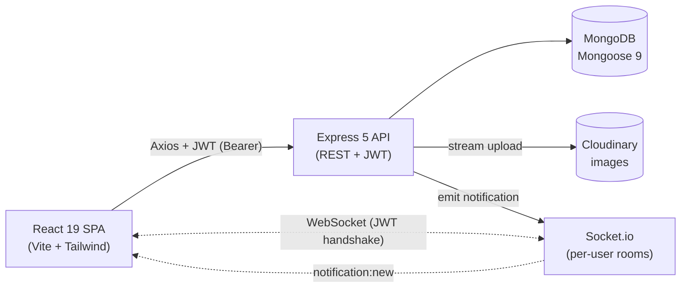

# Pulse — Step-by-Step Build Guide

> **Archived: original build playbook.** This guide is the original roadmap used to build Pulse, the full-stack social media platform. It is preserved as a making-of narrative; the codebase may have evolved since the guide was written, so treat individual snippets as intent rather than the literal current source. For current setup, architecture, and deployment notes, see [`../README.md`](../README.md).

---

> **Project Summary:** Pulse is a MERN social media platform. Visitors browse a public landing page and a trending explore feed; registered users get JWT-authenticated sessions, a follow graph, a personalized reverse-chronological feed, text/image posts (Cloudinary), comments, likes, and real-time notifications delivered over Socket.io to a private per-user room. Two roles exist — `user` and `admin` — with an admin moderation panel for users, posts, and comments. Security layers include Helmet, a single-origin CORS whitelist, layered rate limiting, NoSQL sanitization, bcrypt password hashing, JWT auth, MIME-checked uploads, and an anti-enumeration 404 strategy. The stack is React 19 + Vite 8 + Tailwind 4 on the client and Express 5 + Mongoose 9 + Socket.io on the server, deployed to Netlify (SPA) and Render (API).

Each step below is a self-contained prompt. Execute them in order.

Stack: MongoDB (Mongoose 9) · Express 5 · React 19 · Node.js ≥20 · Socket.io 4 · Cloudinary 2 · JWT · Tailwind CSS 4 · Vite 8

---

## Table of Contents

**PHASE 1 — Backend Foundation**

- STEP 1 — Project Scaffolding & Dependency Setup
- STEP 2 — Environment Loader & Config Clients
- STEP 3 — Express App Skeleton & Security Middleware
- STEP 4 — Error Handling & Async Wrapper
- STEP 5 — User Model & Auth Primitives

**PHASE 2 — Backend Resources**

- STEP 6 — Authentication (register / login / me / password / delete)
- STEP 7 — Users, Profiles & the Follow Graph
- STEP 8 — Posts CRUD with Cloudinary Images
- STEP 9 — Comments & Likes
- STEP 10 — Personalized Feed
- STEP 11 — Notifications & Socket.io Real-Time Layer
- STEP 12 — Uploads (Avatar) & Admin Moderation
- STEP 13 — Swagger / OpenAPI Documentation

**PHASE 3 — Client Foundation**

- STEP 14 — Client Scaffolding (Vite + Tailwind)
- STEP 15 — Axios Instance & Service Layer
- STEP 16 — Context Providers (Auth · Preferences · Socket · Notification)
- STEP 17 — Routing, Guards & Layouts
- STEP 18 — UI Primitives & Hooks

**PHASE 4 — Client Pages**

- STEP 19 — Auth Pages (Login / Register)
- STEP 20 — Feed & Post Composer
- STEP 21 — Explore, Search & Post Detail
- STEP 22 — Profiles, Follow Lists & Edit Profile
- STEP 23 — Notifications & Settings
- STEP 24 — Admin Panel

**PHASE 5 — Polish & Deploy**

- STEP 25 — Accessibility Pass
- STEP 26 — Performance Pass
- STEP 27 — Seeds (admin + demo)
- STEP 28 — Deployment (Render + Netlify)

**Appendices**

- Appendix A — Shared Constants & Environment Variables
- Appendix B — Security Checklist
- Appendix C — Common Pitfalls
- Appendix D — Pre-flight Checklist

---

## Global Build Rules (apply to EVERY step)

- **No git operations.** Do not run `git` commands, do not commit, and do not push. Version control is handled manually by the user.
- **No unapproved packages.** Only install the dependencies named in a step. Prefer native methods over new dependencies.
- **No long-running processes** (dev servers, watchers) unless the step explicitly requests them.
- **Treat every step as self-contained.** Read the files it names, make the change, and verify the acceptance checklist before moving on.
- **Modern JS only.** ES modules, async/await, React Hooks. No class components, no CommonJS `require`.
- **Security, accessibility, and performance are first-class**, not afterthoughts. Every endpoint validates input; every interactive element is keyboard-reachable.
- **Secrets never touch the repo.** Only `.env.example` placeholders are tracked.

---

## Architecture at a Glance



- **Client** is a single-page React app. State that must outlive a render lives in four contexts (auth, preferences, socket, notifications); everything else is local.
- **Server** is a stateless Express API. Each feature owns a router → controller → model slice, with shared middleware for auth, validation, sanitization, and rate limiting.
- **Database** is MongoDB with four collections (`User`, `Post`, `Comment`, `Notification`). Denormalised counters keep feeds fast; document `deleteOne` cascade hooks keep them consistent.
- **Realtime** is a JWT-gated Socket.io server attached to the same HTTP server. Each socket joins a private `user:{id}` room; controllers emit `notification:new` to recipients.
- **Storage** is Cloudinary for avatars and post images, uploaded as streamed in-memory buffers.

---

# PHASE 1 — BACKEND FOUNDATION

---

## STEP 1 — Project Scaffolding & Dependency Setup

**Goal:** Create the `server/` workspace as an ES-module Node project with all runtime dependencies.

**Files/folders:**

```
server/
├── config/  controllers/  middleware/  models/
├── routes/  seed/  services/  socket/  utils/  validators/
├── index.js
├── .env.example
└── package.json
```

**Dependencies (runtime):** `express`, `mongoose`, `jsonwebtoken`, `bcryptjs`, `cors`, `helmet`, `morgan`, `dotenv`, `express-rate-limit`, `express-validator`, `express-mongo-sanitize`, `multer`, `streamifier`, `cloudinary`, `socket.io`, `swagger-jsdoc`, `swagger-ui-express`.
**Dependencies (dev):** `nodemon`.

**Implementation notes:**

- `package.json` must set `"type": "module"` and `"engines": { "node": ">=20" }`.
- Scripts: `dev` (`nodemon index.js`), `start` (`node index.js`), `seed:admin`, `seed:demo`, `seed:demo:wipe`.

**Acceptance:** `node --check index.js` passes on an empty entry; `npm install` completes cleanly.

---

## STEP 2 — Environment Loader & Config Clients

**Goal:** Centralise configuration and external clients so no other file reads `process.env` directly.

**Files:** `config/env.js`, `config/db.js`, `config/cloudinary.js`.

**Implementation notes:**

- `env.js` imports `"dotenv/config"`, reads typed values with small `readString` / `readNumber` helpers, and exports a **frozen** object. Derive `isProduction` / `isDevelopment` / `isTest` from `NODE_ENV`.
- Add **fail-fast** production validation: in `production`, exit the process if `MONGO_URI`, Cloudinary keys are missing, or `JWT_SECRET` is shorter than 32 chars.
- `db.js` connects via `mongoose.connect(env.MONGO_URI)` and logs only in development.
- `cloudinary.js` configures the SDK and exports `uploadBuffer(buffer, folder)` (streamed via `streamifier`) and `destroyByPublicId(publicId)` that swallows non-fatal errors.

**Acceptance:** Importing `env` throws nothing in development with a partial `.env`; production boot aborts with a clear message when a secret is missing.

---

## STEP 3 — Express App Skeleton & Security Middleware

**Goal:** Compose the Express app with security middleware in the correct order, then attach an `http.Server` for Socket.io.

**Files:** `index.js`, `middleware/sanitize.js`, `middleware/rateLimiters.js`.

**Implementation notes (order is load-bearing):**

1. `app.disable("x-powered-by")` and `app.set("trust proxy", 1)` (real client IP behind Render's proxy).
2. `helmet({ contentSecurityPolicy: false })` — CSP off only because the welcome page and Swagger UI use inline styles.
3. `cors({ origin: env.CLIENT_URL, credentials: true, methods: ["GET","POST","PATCH","DELETE"] })`.
4. `express.json({ limit: "10kb" })` + matching urlencoded limit (DoS guard).
5. Custom `sanitize` middleware: call `mongoSanitize.sanitize()` on `req.body` and `req.params` **only** — in Express 5 `req.query` is a read-only getter, so calling `mongoSanitize()` globally throws.
6. `morgan("dev")` in development only.
7. `globalLimiter` (300 / 15min) mounted on `/api`.
8. `GET /api/health` before route mounts.

Rate limiters use `express-rate-limit` v8 with `limit` (not legacy `max`) and `standardHeaders: "draft-8"`: `globalLimiter` 300/15min, `authLimiter` 10/15min, `writeLimiter` 30/min, `adminLimiter` 100/15min.

**Acceptance:** `GET /api/health` returns `{ status, uptime, env, timestamp }`; a `$`-prefixed body key is stripped before controllers run.

---

## STEP 4 — Error Handling & Async Wrapper

**Goal:** A single error contract and a wrapper that removes `try/catch` noise from controllers.

**Files:** `utils/asyncHandler.js`, `middleware/errorHandler.js`.

**Implementation notes:**

- `asyncHandler(fn)` returns `(req, res, next) => Promise.resolve(fn(req,res,next)).catch(next)`.
- `errorHandler` returns `{ status: "error", message }` and includes `stack` only when `NODE_ENV !== "production"`. Map Mongoose `ValidationError`, `CastError`, and duplicate-key (`11000`) to sensible messages/status codes.
- `notFoundHandler` returns a 404 for unmatched routes. Both are mounted **last** in `index.js`.

**Acceptance:** A controller that throws surfaces a JSON error with the right status and no stack trace in production.

---

## STEP 5 — User Model & Auth Primitives

**Goal:** The `User` schema with hashing, public projection, and the JWT helper.

**Files:** `models/User.js`, `utils/generateToken.js`, `utils/pickFields.js`.

**Implementation notes:**

- Fields: `username` (unique, lowercase, `^[a-z0-9_]+$`, 3–20), `name`, `email` (unique, validated), `password` (`select: false`, min 8, complexity = at least one letter + one digit), `bio`, `avatar`/`banner` sub-docs (`{ url, publicId }`), `role` (`user`|`admin`), `following`/`followers` arrays, denormalised `followersCount`/`followingCount`/`postsCount`, a `preferences` sub-doc (theme, fontSize, reduceMotion, privacy, notifications), and `isActive`.
- `pre("save")` hook hashes the password with bcrypt (12 rounds) **only when modified**. Skip re-hashing already-hashed values (start with `$2`).
- `comparePassword(plain)` and `toPublicProfile({ viewerId })` — the latter exposes `email` only to the owner or when `showEmail` is on, and `preferences` only to the owner.
- `generateToken(id)` signs `{ id }` with `JWT_SECRET` / `JWT_EXPIRES_IN`.

**Acceptance:** Creating a user stores a bcrypt hash; `toPublicProfile` hides email/preferences from strangers.

---

# PHASE 2 — BACKEND RESOURCES

---

## STEP 6 — Authentication

**Goal:** Email/password auth with JWT plus self-service password change and account deletion.

**Files:** `controllers/authController.js`, `routes/authRoutes.js`, `validators/authValidator.js`, `middleware/auth.js` (`protect`), `middleware/optionalAuth.js`.

**Endpoints:** `POST /register`, `POST /login` (both behind `authLimiter`), `GET /me` (protect), `PATCH /change-password` (protect), `DELETE /delete-account` (protect, verifies password, runs the User cascade).

**Implementation notes:**

- `protect` reads `Authorization: Bearer <token>`, verifies it, loads the user, and attaches `req.user`; rejects inactive accounts.
- `optionalAuth` does the same but never rejects — it just enriches `req.user` when a valid token is present.
- Validators (`express-validator`) enforce email/username/password shape; `validate` middleware turns errors into a 422 with a field list.

**Acceptance:** Login returns `{ token, user }`; `/me` returns the current profile; wrong password on delete returns 401.

---

## STEP 7 — Users, Profiles & the Follow Graph

**Goal:** Public profiles, search, profile updates, and an idempotent follow toggle.

**Files:** `controllers/userController.js`, `controllers/followController.js`, `routes/userRoutes.js`, `validators/userValidator.js`, `utils/escapeRegex.js`.

**Endpoints:** `GET /search?q=` (optionalAuth, excludes self), `PATCH /me` (protect), `GET /:username` (optionalAuth, privacy-aware, `isFollowing`), `GET /:username/followers`, `GET /:username/following` (cursor-paginated), `POST /:id/follow` (protect, toggle).

**Implementation notes:**

- Search uses `escapeRegex` to neutralise regex metacharacters before `$regex` (ReDoS-safe).
- Follow toggle uses conditional `$addToSet` / `$pull` plus race-safe counter updates so rapid double-clicks can't drift `followersCount` / `followingCount`.
- Private accounts hide follower/following lists from non-followers (404, not 403).

**Acceptance:** Following twice is a no-op; counters stay correct under rapid toggling.

---

## STEP 8 — Posts CRUD with Cloudinary Images

**Goal:** Create/read/update/delete posts with optional images and a cascade-safe delete.

**Files:** `models/Post.js`, `controllers/postController.js`, `routes/postRoutes.js`, `validators/postValidator.js`, `middleware/upload.js`.

**Endpoints:** `GET /explore` (optionalAuth), `GET /user/:username` (optionalAuth), `GET /:id` (optionalAuth), `POST /` (protect → writeLimiter → uploadPostImage → validate → createPost), `PATCH /:id`, `DELETE /:id`.

**Implementation notes:**

- **Route ordering matters:** declare `/explore` and `/user/:username` before `/:id` or the catch-all swallows them.
- `Post` schema: `author`, conditionally-required `content` (≤1000), `image` sub-doc, `likes[]`, denormalised `likesCount`/`commentsCount`, `isHidden`. A `pre("validate")` hook requires content **or** image. Compound indexes: `{ createdAt:-1 }`, `{ author:1, createdAt:-1 }`, `{ likesCount:-1, createdAt:-1 }`.
- `createPost` streams the buffer to Cloudinary first; if `Post.create` then fails, it rolls back the orphan asset.
- A document `pre("deleteOne")` hook deletes related comments + notifications, destroys the Cloudinary image, and decrements `postsCount`. Resolve sibling models lazily via `mongoose.model(name)` to dodge circular imports.
- Cursor pagination: fetch `limit + 1`, slice, and use the last `_id` as `nextCursor`. Mass-assignment protection: read only `content` from the body.

**Acceptance:** Deleting a post removes its comments, notifications, and Cloudinary asset; explore supports `?sort=trending|latest` and `?q=`.

---

## STEP 9 — Comments & Likes

**Goal:** Nested comments and an idempotent like toggle, both with consistent counters.

**Files:** `models/Comment.js`, `controllers/commentController.js`, `controllers/likeController.js`, `routes/commentRoutes.js`, `validators/commentValidator.js`.

**Endpoints:** `POST /api/posts/:postId/comments`, `GET /api/posts/:postId/comments` (cursor-paginated), `DELETE /api/comments/:id` (owner / post-author / admin), `POST /api/posts/:id/like` (toggle).

**Implementation notes:**

- Nested comment routes live in `postRoutes.js`; the standalone delete lives in `commentRoutes.js`. All three share `commentController.js`.
- `Comment` has a document `deleteOne` cascade hook that decrements the parent post's `commentsCount` and removes related notifications.
- Like toggle uses `$addToSet` + conditional `updateOne` so concurrent taps cannot drift `likesCount`. Each like/comment emits a notification (STEP 11).
- All writes pass through `writeLimiter` (30/min) to block spam-notify harassment.

**Acceptance:** Liking twice toggles cleanly; deleting a comment decrements the counter exactly once.

---

## STEP 10 — Personalized Feed

**Goal:** A cursor-paginated timeline of followed authors plus the viewer's own posts.

**Files:** `controllers/feedController.js`, `routes/feedRoutes.js`, `validators/feedValidator.js`.

**Endpoint:** `GET /api/feed` (protect, cursor-paginated).

**Implementation notes:**

- Build the author set from `req.user.following` plus `req.user._id`, filter `isHidden: false`, sort by `_id` desc, and paginate with the same `limit + 1` cursor pattern as posts.
- Decorate each post with `isLikedByMe` for the viewer.

**Acceptance:** A fresh post by a followed user appears at the top of the feed; pagination is stable while new posts arrive.

---

## STEP 11 — Notifications & Socket.io Real-Time Layer

**Goal:** Persist notifications and deliver them live to the recipient.

**Files:** `models/Notification.js`, `controllers/notificationController.js`, `routes/notificationRoutes.js`, `services/notificationService.js`, `socket/index.js`, `socket/socketAuth.js`.

**Endpoints:** `GET /` (cursor-paginated), `GET /unread-count`, `PATCH /read-all`, `PATCH /:id/read`, `DELETE /:id` (all recipient-scoped, protect).

**Implementation notes:**

- `Notification` fields: `recipient`, `actor`, `type` (`like`|`comment`|`follow`), `post` (optional), `comment` (optional), `isRead`. Suppress self-notifications (never notify yourself). Respect the recipient's `preferences.notifications` toggles.
- `notificationService.createNotification(...)` writes the doc, populates the actor, and emits `notification:new` to `user:{recipientId}` via `getIo()`.
- `socket/index.js` attaches `Server` to the HTTP server with the same CORS origin, runs `socketAuth` (verifies the JWT from `handshake.auth.token`, loads the user), joins `user:{id}`, and tracks online sockets in a `Map<userId, Set<socketId>>`.

**Acceptance:** Liking another user's post pushes a live `notification:new` to their room and increments their unread badge; self-actions create no notification.

---

## STEP 12 — Uploads (Avatar) & Admin Moderation

**Goal:** Avatar upload/remove and the full admin moderation surface.

**Files:** `controllers/uploadController.js`, `routes/uploadRoutes.js`, `controllers/adminController.js`, `routes/adminRoutes.js`, `middleware/adminOnly.js`, `validators/adminValidator.js`.

**Endpoints:** `POST /api/uploads/avatar`, `DELETE /api/uploads/avatar`; `GET /api/admin/stats`, `GET/PATCH/DELETE` for `/admin/users`, `/admin/posts`, `/admin/comments`.

**Implementation notes:**

- `upload.js` uses `multer` memoryStorage with a MIME whitelist (`png/jpeg/webp/gif`) and per-route size caps (avatar 2 MB, post image 5 MB).
- `adminOnly` returns **401** for anonymous and **403** for non-admins so the client can disambiguate. The entire admin router sits behind `adminLimiter`.
- Admin guards against self-demotion, self-deletion, and removing the last admin. Admin deletes use document `deleteOne` so cascades fire.

**Acceptance:** A non-admin hitting `/api/admin/stats` gets 403; an oversized avatar is rejected before reaching Cloudinary.

---

## STEP 13 — Swagger / OpenAPI Documentation

**Goal:** Interactive API docs and a themed API welcome page.

**Files:** `config/swagger.js`, JSDoc blocks across routes, welcome page in `index.js`.

**Implementation notes:**

- `swagger-jsdoc` builds the spec from route JSDoc; serve interactive UI at `/api-docs` and raw JSON at `/api-docs.json`.
- `GET /` returns a self-contained themed HTML welcome page (no external assets) with version and quick links.

**Acceptance:** `/api-docs` lists every endpoint with a working "Try it out"; `/api-docs.json` returns valid OpenAPI 3.

---

# PHASE 3 — CLIENT FOUNDATION

---

## STEP 14 — Client Scaffolding (Vite + Tailwind)

**Goal:** A React 19 + Vite 8 SPA with Tailwind 4 and the design-token base.

**Files:** `client/package.json`, `vite.config.js`, `eslint.config.js`, `src/main.jsx`, `src/index.css`, `public/_redirects`.

**Dependencies:** `react`, `react-dom`, `react-router-dom`, `axios`, `socket.io-client`, `lucide-react`, `date-fns`, `react-hot-toast`, `@fontsource-variable/inter`. Dev: `vite`, `@vitejs/plugin-react`, `tailwindcss`, `@tailwindcss/vite`, eslint plugins.

**Implementation notes:**

- Tailwind 4 via the official `@tailwindcss/vite` plugin; design tokens (brand colours, durations) declared in `index.css`.
- `public/_redirects` contains `/* /index.html 200` for Netlify SPA deep links.
- `main.jsx` uses `createBrowserRouter` (data router — required for `useBlocker`) hosting a single catch-all route that wraps the provider tree.

**Acceptance:** `npm run dev` serves the SPA; `npm run build` produces `dist/`; `npm run lint` is clean.

---

## STEP 15 — Axios Instance & Service Layer

**Goal:** One configured Axios client and a thin per-resource service layer.

**Files:** `src/api/axios.js`, `src/services/*.js`.

**Implementation notes:**

- Axios `baseURL = import.meta.env.VITE_API_URL`. A request interceptor attaches `Authorization: Bearer <token>` from `localStorage`; a response interceptor clears the token and redirects to `/login` on 401.
- One service module per resource (`authService`, `userService`, `postService`, `commentService`, `feedService`, `notificationService`, `uploadService`, `adminService`) returning unwrapped `response.data`.

**Acceptance:** A protected request without a token redirects to `/login`; services never reference `localStorage` directly.

---

## STEP 16 — Context Providers

**Goal:** Four contexts that own cross-cutting state, wired in a deliberate order.

**Files:** `src/context/AuthContext.jsx`, `PreferencesContext.jsx`, `SocketContext.jsx`, `NotificationContext.jsx`, plus the matching `useX.js` hook files.

**Implementation notes:**

- Provider order: `Auth → Preferences → Socket → Notification` (each depends on the previous).
- `AuthContext` mirrors the `localStorage` token to state, calls `getMe()` on boot (with a `loading` flag so guards don't flash), and exposes `login`/`register`/`logout`/`updateUser`/`isAdmin`.
- Keep each `useX` hook in its own file so React Fast Refresh stays happy (components and hooks not mixed in one module).
- `PreferencesContext` applies theme/fontSize/reduceMotion to `document` and auto-saves changes; `SocketContext` opens the JWT handshake; `NotificationContext` subscribes to `notification:new`.

**Acceptance:** A hard refresh keeps the session; toggling theme persists and reapplies on reload.

---

## STEP 17 — Routing, Guards & Layouts

**Goal:** The route tree with lazy loading, three guards, and three layouts.

**Files:** `src/App.jsx`, `src/components/guards/*`, `src/components/layout/*`.

**Implementation notes:**

- Every page is `React.lazy()` + a shared `<Suspense fallback={<Spinner fullScreen/>}>`; the `ErrorBoundary` is re-keyed on `pathname`.
- Guards: `GuestOnlyRoute` (keeps signed-in users out of `/login`/`/register`), `ProtectedRoute`, `AdminRoute` (signed in AND `role === "admin"`).
- Layouts: `MainLayout`, `SettingsLayout`, `AdminLayout`. Public read surfaces (post detail, public profile, explore) stay outside `ProtectedRoute` so deep links work for guests. `HomeRoute` branches the index on auth: feed for users, landing for guests.

**Acceptance:** Guests deep-linking to a public profile see it; visiting `/settings` while logged out redirects to login.

---

## STEP 18 — UI Primitives & Hooks

**Goal:** A reusable, accessible UI kit and the custom hooks pages rely on.

**Files:** `src/components/ui/*`, `src/components/user/*`, `src/hooks/*`.

**Implementation notes:**

- Primitives: `Button`, `IconButton`, `Input`, `Textarea`, `Modal`, `ConfirmModal`, `Dropdown`, `Popover`, `Tooltip`, `Tabs`, `Badge`, `Banner`, `Avatar`, `Spinner`, `Skeleton` (+ skeleton variants), `ToggleSwitch`, `SegmentedControl`, `EmptyState`, `ErrorBoundary`.
- Hooks: `useInfiniteScroll` (IntersectionObserver), `useDebounce`, `useClickOutside`, `useEscapeKey`, `useMediaQuery`, `useDocumentTitle`, `useAutoResizeTextarea`, `usePreferenceAutoSave`, `useUnsavedChangesPrompt` (uses `useBlocker`).
- Every icon-only control carries an `aria-label`; modals trap focus and close on Escape.

**Acceptance:** Components are keyboard-navigable; `useInfiniteScroll` fetches the next page near the viewport edge.

---

# PHASE 4 — CLIENT PAGES

---

## STEP 19 — Auth Pages (Login / Register)

**Goal:** Accessible split-screen auth forms wired to `AuthContext`.

**Files:** `src/pages/auth/Login.jsx`, `Register.jsx`, `src/components/layout/AuthShell.jsx`, `src/components/ui/PasswordInput.jsx`, `src/components/settings/PasswordStrengthMeter.jsx`.

**Implementation notes:**

- Client-side validation mirrors the server rules; on success, store the token via the context and redirect to the intended route or `/`.
- `PasswordInput` has a show/hide toggle with a proper label; register shows a live strength meter.

**Acceptance:** Submitting valid credentials lands on the feed; field errors are announced and focus moves to the first invalid input.

---

## STEP 20 — Feed & Post Composer

**Goal:** The personalized feed with an inline composer and optimistic interactions.

**Files:** `src/pages/feed/FeedPage.jsx`, `src/pages/post/CreatePostPage.jsx`, `src/components/post/CreatePostForm.jsx`, `PostCard.jsx`, `PostGrid.jsx`.

**Implementation notes:**

- Composer supports text + one image with a character counter and client-side MIME/size pre-check; uploads via multipart.
- `PostCard` handles like (optimistic), comment navigation, and owner/admin delete via `ConfirmModal`. Feed uses `useInfiniteScroll`.

**Acceptance:** Posting prepends to the feed without a full reload; liking updates instantly and reconciles with the server response.

---

## STEP 21 — Explore, Search & Post Detail

**Goal:** Public discovery (trending/latest + search) and the threaded post detail page.

**Files:** `src/pages/explore/ExplorePage.jsx`, `src/pages/post/PostDetailPage.jsx`, `src/components/post/CommentItem.jsx`.

**Implementation notes:**

- Explore debounces the search box (400 ms) and mirrors `q`/`sort` to the URL via `useSearchParams` for shareable deep links. Use **render-time state resets** (not synchronous `setState` inside effects) when fetch inputs change, to avoid cascading-render lint errors.
- Guests can browse but follow/like/comment opens a "Sign in to interact" modal.
- Post detail loads the post + cursor-paginated comments and hosts the comment composer.

**Acceptance:** Searching updates the URL and results without a full navigation; a guest trying to like sees the auth prompt.

---

## STEP 22 — Profiles, Follow Lists & Edit Profile

**Goal:** Public profile pages, follower/following lists, and the dirty-form-guarded edit page.

**Files:** `src/pages/profile/ProfilePage.jsx`, `FollowersPage.jsx`, `FollowingPage.jsx`, `FollowListView.jsx`, `EditProfilePage.jsx`, `src/components/user/ProfileHeader.jsx`, `FollowButton.jsx`.

**Implementation notes:**

- Profile shows avatar/banner, bio, counts, and a post grid; respects privacy (private accounts hide content from non-followers).
- `EditProfilePage` edits name/username/bio + avatar upload, and uses `useUnsavedChangesPrompt` to block navigation with unsaved changes.
- `FollowButton` optimistically toggles and surfaces `onRequireAuth` for guests.

**Acceptance:** Editing and navigating away with unsaved changes prompts a confirm; following from a list updates the button and counts.

---

## STEP 23 — Notifications & Settings

**Goal:** The notifications page/dropdown and the four auto-saving settings sections.

**Files:** `src/pages/notifications/NotificationsPage.jsx`, `src/components/notification/NotificationBell.jsx`, `NotificationItem.jsx`, `src/pages/settings/{Account,Appearance,Privacy,Notification}Settings.jsx`, `src/components/settings/*`.

**Implementation notes:**

- The bell shows a live unread badge (polite live region) and a dropdown; the page lists all notifications with mark-read / mark-all / delete.
- Settings sections auto-save via `usePreferenceAutoSave` with a `SaveIndicator`. Account section hosts change-password and delete-account (with `ConfirmModal`).

**Acceptance:** A new notification updates the badge in real time; changing the theme saves automatically and shows a saved indicator.

---

## STEP 24 — Admin Panel

**Goal:** The moderation dashboard and management tables.

**Files:** `src/pages/admin/{AdminDashboard,AdminUsers,AdminPosts,AdminComments}.jsx`, `src/components/admin/*`.

**Implementation notes:**

- Dashboard shows counts + top users. Tables support filters and pagination (`AdminFiltersBar`, `AdminPagination`, `AdminSelect`).
- User actions: change role, toggle active, delete — disable the controls that the server protects (self, last admin) so the UI matches server rules.

**Acceptance:** Admin can hide/delete posts and comments; protected actions are disabled in the UI and rejected by the API.

---

# PHASE 5 — POLISH & DEPLOY

---

## STEP 25 — Accessibility Pass

**Goal:** Meet a WCAG 2.1 AA baseline.

**Implementation notes:**

- Semantic landmarks (`header`/`nav`/`main`/`footer`), logical heading order, visible `:focus-visible` rings, `aria-label` on icon-only buttons, a polite live region on the bell, and `prefers-reduced-motion` honoured (motion-safe utilities).
- No `dangerouslySetInnerHTML` anywhere — rely on React's default escaping for user content.

**Acceptance:** Full keyboard traversal works; reduced-motion disables non-essential animation.

---

## STEP 26 — Performance Pass

**Goal:** Fast first load and stable layout.

**Implementation notes:**

- Route-level `React.lazy()` code splitting; named imports for `lucide-react` and `date-fns` (tree-shaking).
- Cloudinary `f_auto,q_auto` transforms; LCP image hinted with `fetchpriority="high"`; skeletons + `aspect-ratio` to avoid CLS.

**Acceptance:** The initial JS bundle stays lean (routing/guards/boundary/spinner only); images don't shift layout on load.

---

## STEP 27 — Seeds (admin + demo)

**Goal:** Idempotent bootstrap data.

**Files:** `server/seed/adminSeed.js`, `demoSeed.js`, `wipeDemo.js`.

**Implementation notes:**

- `adminSeed` reads `ADMIN_EMAIL`/`ADMIN_USERNAME`/`ADMIN_PASSWORD` and either creates the admin or re-promotes/reset-passwords an existing user (idempotent).
- `demoSeed` creates sample users/posts for screenshots; `wipeDemo` removes them.

**Acceptance:** Running `npm run seed:admin` twice is safe; the admin can log in immediately afterward.

---

## STEP 28 — Deployment (Render + Netlify)

**Goal:** Ship the API and SPA with matching origins.

**Files:** `render.yaml`, `netlify.toml`.

**Implementation notes:**

- **Render (API):** root `server`, build `npm install`, start `npm start`. Set `NODE_ENV=production`, `MONGO_URI`, a fresh 32+ char `JWT_SECRET`, Cloudinary keys, `CLIENT_URL` (the exact Netlify URL, no trailing slash), and admin seed vars. Run the admin seed once via the shell.
- **Netlify (SPA):** base `client`, build `npm run build`, publish `client/dist`. Set `VITE_API_URL` and `VITE_SOCKET_URL` to the Render URL.
- `CLIENT_URL` (API) and `VITE_API_URL`/`VITE_SOCKET_URL` (SPA) must match **exactly** or CORS / the WebSocket handshake will reject every request.

**Acceptance:** The deployed SPA authenticates against the deployed API and receives live notifications over the WebSocket.

---

# Appendix A — Shared Constants & Environment Variables

**Pagination:** default page size 12, hard cap 30; cursor = last item `_id`, fetch `limit + 1` to compute `hasMore`.
**Limits:** post content ≤ 1000, bio ≤ 200, username 3–20, password 8–128; avatar ≤ 2 MB, post image ≤ 5 MB.
**Rate limits:** global 300/15min, auth 10/15min, write 30/min, admin 100/15min.
**Trending window:** 90 days for the explore `trending` sort.

**`server/.env`:** `NODE_ENV`, `PORT`, `MONGO_URI`, `JWT_SECRET`, `JWT_EXPIRES_IN`, `CLIENT_URL`, `CLOUDINARY_CLOUD_NAME`, `CLOUDINARY_API_KEY`, `CLOUDINARY_API_SECRET`, `ADMIN_EMAIL`, `ADMIN_USERNAME`, `ADMIN_PASSWORD`.
**`client/.env`:** `VITE_API_URL`, `VITE_SOCKET_URL`.

---

# Appendix B — Security Checklist

- Helmet on; `x-powered-by` disabled; `trust proxy` set to 1.
- CORS single-origin whitelist with credentials; only `GET/POST/PATCH/DELETE`.
- Body limit 10kb; NoSQL sanitization on `body` + `params` (never `query` in Express 5).
- Layered rate limiting on every `/api` route, auth, writes, and admin.
- bcrypt (12 rounds); JWT ≥ 32-char secret enforced in production.
- Owner-or-admin checks on every mutation; admin self/last-admin protections.
- Anti-enumeration: missing/hidden/private resources return 404, not 403.
- MIME-checked, size-capped uploads streamed to Cloudinary.
- JWT-gated Socket.io handshake; private `user:{id}` rooms.
- No `dangerouslySetInnerHTML`; `.env` gitignored (only `.env.example` tracked).

---

# Appendix C — Common Pitfalls

- **Express 5 `req.query` is read-only** — never call `mongoSanitize()` globally; sanitize `body`/`params` only.
- **Route ordering** — literal/nested routes (`/explore`, `/user/:username`) must precede `/:id`.
- **Circular model imports** — resolve sibling models inside cascade hooks with `mongoose.model(name)`, not top-level imports.
- **Cascade requires document deletes** — use `doc.deleteOne()`, not `Model.deleteMany()`, or the hooks won't fire.
- **`setState` inside effects** — when syncing to changing inputs, prefer render-time resets (track a "prev key") over synchronous `setState` in an effect body to avoid cascading-render warnings.
- **Fast Refresh** — keep hooks and components in separate files; an entry file with a component but no exports warns.
- **Origin mismatch** — `CLIENT_URL` and `VITE_API_URL`/`VITE_SOCKET_URL` must match exactly (no trailing slash).

---

# Appendix D — Pre-flight Checklist

- [ ] `server` and `client` install cleanly on Node ≥ 20.
- [ ] `server/.env` and `client/.env` created from the examples.
- [ ] `GET /api/health` returns ok; `/api-docs` loads.
- [ ] Admin seeded; admin can log in.
- [ ] Register → follow → post → like → comment produces a live notification.
- [ ] `npm run lint` (client) is clean; `npm run build` (client) succeeds.
- [ ] Deployed origins match between API and SPA.
